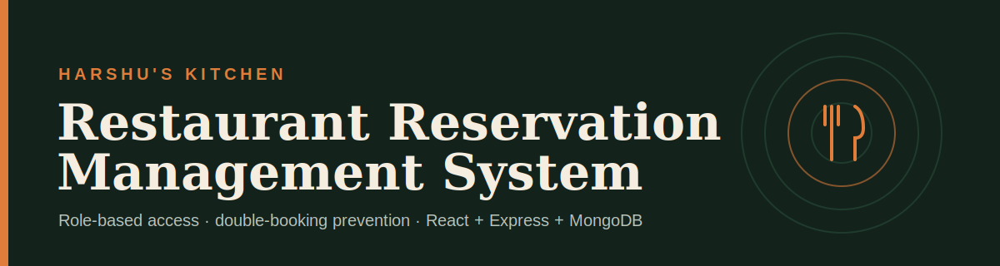
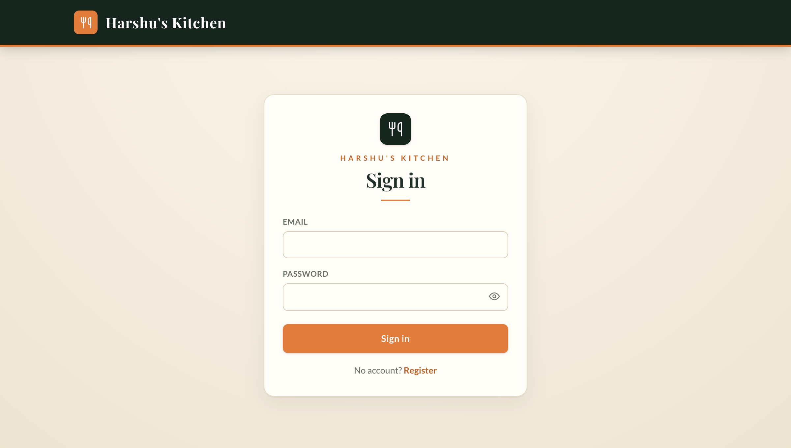
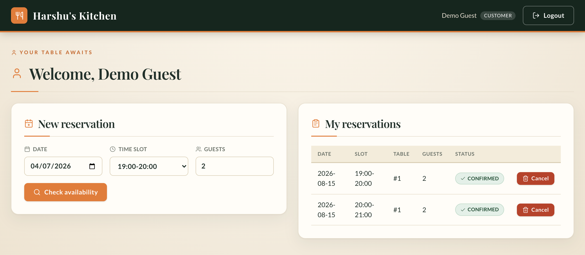
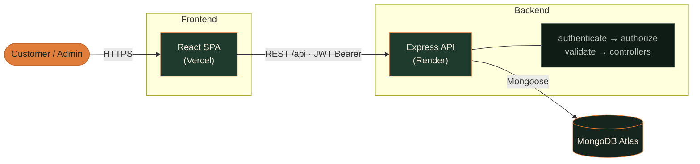
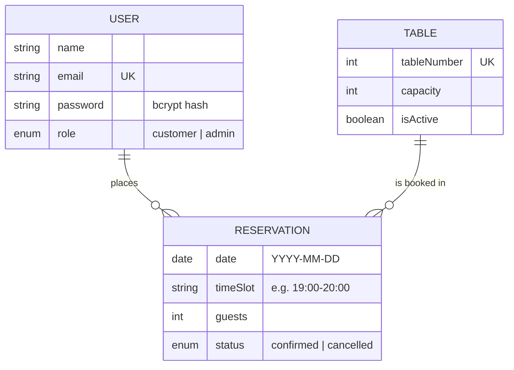
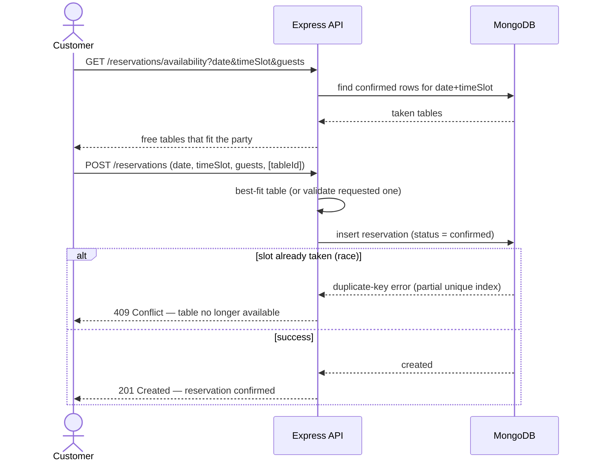
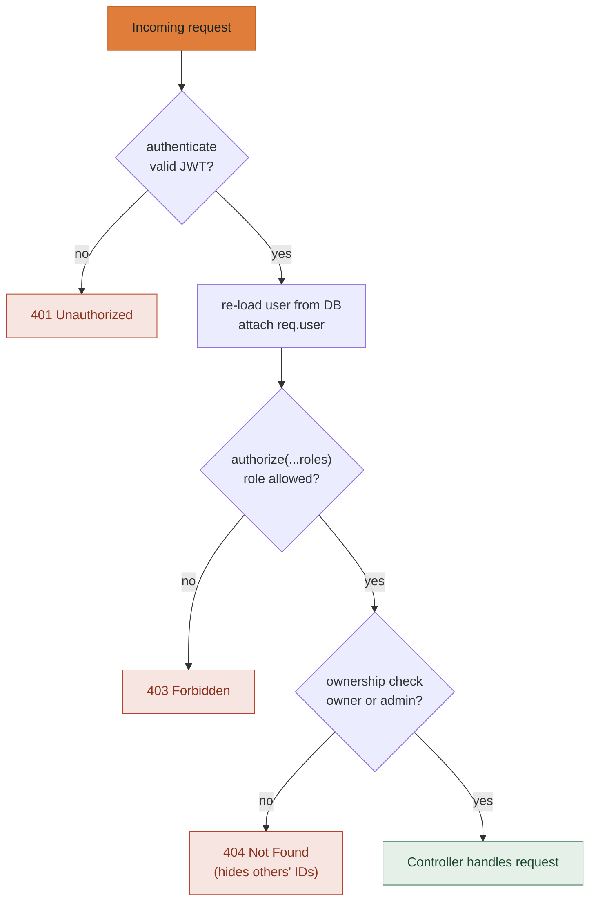

<p align="center">
  
</p>

<h1 align="center">Restaurant Reservation Management System</h1>

<p align="center">
  A full-stack restaurant reservation system with <b>role-based access</b> (Customer / Admin),
  robust <b>double-booking prevention</b>, and a clean React UI.
</p>

<p align="center">
  
  
  
  
  
  
  
</p>

<p align="center">
  <a href="https://restaurant-reservation-puce-omega.vercel.app/"><b>🌐 Live App</b></a> &nbsp;·&nbsp;
  <a href="https://restaurant-reservation-c8rx.onrender.com/api/health"><b>🩺 API Health</b></a> &nbsp;·&nbsp;
  <a href="#-screenshots"><b>📸 Screenshots</b></a> &nbsp;·&nbsp;
  <a href="#1-setup--run-locally"><b>⚙️ Setup</b></a>
</p>

### 🔗 Live Demo
| | URL |
| --- | --- |
| **Frontend (Vercel)** | https://restaurant-reservation-puce-omega.vercel.app/ |
| **Backend API (Render)** | https://restaurant-reservation-c8rx.onrender.com |

> The backend runs on Render's free tier — the **first** request after idle may take ~30–60s to cold-start.

## 📸 Screenshots

| Sign in | Customer dashboard |
| :---: | :---: |
| [](docs/screenshots/login.png) | [](docs/screenshots/customer.png) |
| JWT auth with a show/hide password toggle | Book a table, check availability, and manage your reservations |

> The admin panel (all-reservations table with inline edit/cancel and table management) is protected behind an admin login — see [§4 Role-Based Access](#4-role-based-access) for the full capability matrix.

## Contents
1. [Setup & Run Locally](#1-setup--run-locally)
2. [Assumptions](#2-assumptions)
3. [Reservation & Availability Logic](#3-reservation--availability-logic)
4. [Role-Based Access](#4-role-based-access)
5. [Testing](#5-testing)
6. [Deployment](#6-deployment)
7. [Known Limitations](#7-known-limitations)
8. [Areas for Improvement](#8-areas-for-improvement-with-more-time)

## 🏗️ Architecture



```
restaurant_reservation/
├── server/            # Express + MongoDB REST API
│   ├── src/
│   │   ├── config/db.js
│   │   ├── models/            User, Table, Reservation
│   │   ├── middleware/        auth (authenticate/authorize), validate, errorHandler
│   │   ├── controllers/       auth, table, reservation
│   │   ├── routes/            auth, table, reservation
│   │   ├── utils/             slots (fixed time slots), ApiError
│   │   ├── seed.js            bootstrap admin (+ optional customer) + tables
│   │   └── index.js / app.js
│   ├── .env.example
│   └── package.json
└── client/            # Vite React SPA
    ├── src/
    │   ├── api/client.js       axios instance + endpoint functions
    │   ├── context/AuthContext.jsx
    │   ├── components/{common,customer,admin}/
    │   ├── pages/              Login, Register, CustomerDashboard, AdminDashboard
    │   └── App.jsx
    ├── .env.example
    └── package.json
```

---

## 1. Setup & Run Locally

### Prerequisites
- Node.js 18+ (tested on Node 20)
- MongoDB running locally **or** a MongoDB Atlas connection string

### Backend
```bash
cd server
cp .env.example .env          # then EDIT the placeholders with real values (see below)
npm install
npm run seed                  # provisions admin (+ optional customer) + 8 tables (idempotent)
npm start                     # http://localhost:5001
```

> **Edit `.env` before seeding.** The seed script reads credentials from the
> environment and **fails fast** if `SEED_ADMIN_EMAIL` / `SEED_ADMIN_PASSWORD`
> are unset — no default admin password is baked into the code. Replace every
> `<...>` placeholder in `.env` first.

**`server/.env`**
| Var | Required | Purpose |
| --- | :---: | --- |
| `PORT` | no | API port (default **5001** — 5000 is taken by macOS AirPlay) |
| `MONGODB_URI` | ✅ | `mongodb://127.0.0.1:27017/restaurant_reservation` or an Atlas URI |
| `JWT_SECRET` | ✅ | Long random string — generate with `openssl rand -hex 32` |
| `JWT_EXPIRES_IN` | no | Token lifetime, e.g. `1d` |
| `CLIENT_ORIGIN` | ✅ | Allowed CORS origin(s), comma-separated (e.g. `http://localhost:5173`) |
| `SEED_ADMIN_EMAIL` / `SEED_ADMIN_PASSWORD` | ✅ (for seed) | Admin account created by `npm run seed` |
| `SEED_CUSTOMER_EMAIL` / `SEED_CUSTOMER_PASSWORD` | no | Optional demo customer; omit both to skip it |

> ⚠️ **Never commit `.env`.** Only `.env.example` (placeholders) is tracked. No
> credentials are hardcoded anywhere in the source. Do not paste real secrets,
> credentials, or customer data into issues/chats.

### Frontend
```bash
cd client
cp .env.example .env          # set VITE_API_URL to the backend URL
npm install
npm run dev                   # http://localhost:5173
```

**`client/.env`**: `VITE_API_URL=http://localhost:5001/api`

### Seeded logins
The seed script provisions accounts from environment variables — **no passwords are
hardcoded**. The admin is required; the customer is optional (skipped if its vars are
unset). You can also just self-register a customer through the UI.

| Role | Email env var | Password env var | Required |
| --- | --- | --- | :---: |
| Admin | `SEED_ADMIN_EMAIL` | `SEED_ADMIN_PASSWORD` | ✅ |
| Customer | `SEED_CUSTOMER_EMAIL` | `SEED_CUSTOMER_PASSWORD` | optional |

Set these in `server/.env` for local dev (see `server/.env.example`) or in your host's
dashboard for a deployment. Use strong, unique passwords and rotate any value that was
ever committed to git history.

---

## 2. Assumptions

- **Single restaurant.** No multi-tenant / multi-location modeling.
- **Fixed, enumerable time slots** — 1-hour blocks from `12:00-13:00` through `22:00-23:00` (see `server/src/utils/slots.js`). This turns conflict-checking into a simple equality query instead of interval-overlap math — easier to get correct and to verify. The client slot list mirrors the server's.
- **Tables are seeded** (8 tables, capacities 2–10). Admins can add/edit/disable tables at runtime.
- **Dates stored as `YYYY-MM-DD` strings** to avoid timezone drift in slot comparisons; "past date" is evaluated against the server's local date.
- **Out of scope (per spec):** payments, notifications, waitlists.

---

## 3. Reservation & Availability Logic

**A table is unavailable for a `date + timeSlot` if a `confirmed` reservation already exists for that exact `table + date + timeSlot`.** Cancelled reservations are ignored, so cancelling frees the slot automatically.

### Data model



> A **partial unique index** on `RESERVATION (table, date, timeSlot)` — filtered to `status: "confirmed"` — is what physically prevents double-booking (see below).

**Booking algorithm** (`server/src/controllers/reservationController.js`):
1. Validate input — valid slot, valid non-past date, `guests ≥ 1`.
2. Compute the set of tables already `confirmed` for that `date + timeSlot`.
3. **If a specific `tableId` is requested:** verify it's active, seats the party, and isn't taken — otherwise return a clear `409`/`400`. Never silently substitute a different table.
4. **If no table specified:** auto-assign the **smallest-capacity table that fits** (best-fit — avoids wasting a 10-top on a party of 2).
5. Insert the reservation.

### Booking flow



### Double-booking prevention (the hard part)
A **partial unique index** on `{ table, date, timeSlot }` filtered to `status: "confirmed"` (`server/src/models/Reservation.js`) makes **MongoDB itself** reject a second confirmed booking for the same table+slot. The application also re-checks availability before insert, but the index is the authoritative guard — it closes the classic race where two simultaneous requests both pass the availability check.

**Verified:** firing 12 simultaneous identical booking requests results in **exactly one `201` and eleven `409`s** (see `server/` test notes below). Because the filter is `status: "confirmed"`, a cancelled row is excluded and the slot becomes rebookable.

---

## 4. Role-Based Access

Two roles: **customer** (default) and **admin**. Every request runs the same guard chain on the server — the client-side role checks are UX only.



| Capability | Customer | Admin |
| --- | :---: | :---: |
| Register / login | ✅ | ✅ |
| View tables | ✅ | ✅ |
| Check availability | ✅ | ✅ |
| Create own reservation | ✅ | — (managed via admin routes) |
| View **own** reservations | ✅ | ✅ (all) |
| Cancel **own** reservation | ✅ | ✅ (any) |
| View **all** reservations / filter by date | — | ✅ |
| Edit any reservation | — | ✅ |
| Create / edit / disable tables | — | ✅ |

**How it's enforced:**
- JWT payload `{ id, role }`, signed with `JWT_SECRET`, ~1-day expiry.
- `authenticate` middleware verifies the token and re-loads the user (a deleted account can't keep acting on a stale token).
- `authorize(...roles)` middleware gates admin-only routes → `403` otherwise.
- **Registration always sets `role: "customer"`** server-side; the client cannot self-assign admin.
- Ownership checks in the controller: a customer cancelling someone else's reservation gets a `404` (not `403`) so they can't probe for others' reservation IDs.
- The React `<ProtectedRoute>` and role-based nav are **UX only** — every request is independently authorized on the backend. Client-side role checks are never trusted for security.

### API summary (`/api`)
| Method | Route | Access |
| --- | --- | --- |
| POST | `/auth/register` · `/auth/login` | Public |
| GET | `/auth/me` | Authenticated |
| GET | `/tables` | Authenticated |
| POST/PUT/DELETE | `/tables` · `/tables/:id` | Admin |
| GET | `/reservations/availability?date=&timeSlot=&guests=` | Authenticated |
| POST | `/reservations` | Customer |
| GET | `/reservations/my` | Customer |
| PATCH | `/reservations/:id/cancel` | Owner or Admin |
| GET | `/reservations?date=&status=` | Admin |
| PATCH | `/reservations/:id` | Admin |

All errors share one shape: `{ "success": false, "message": "...", "errors": [ … ] }`. Status codes used: `200/201/400/401/403/404/409/500`.

---

## 5. Testing

Backend was verified against a live MongoDB with an end-to-end script covering all
required cases — double-booking → `409`, oversized party → `409`, same table across
different slots → both succeed, cancel-frees-slot, cross-customer isolation (`404`),
non-admin → admin route → `403`, missing/malformed JWT → `401`, admin-cancels-customer
reflected in the customer's list — plus a **concurrency race test** (12 simultaneous
bookings → exactly 1 success). All 23 assertions + the race test passed.

To reproduce locally: start the server, then run a script that hits the API base at
`http://localhost:5001/api` (see §3/§4 for the exact expected status codes).

---

## 6. Deployment

- **Database:** MongoDB Atlas (free tier). Whitelist the backend host / `0.0.0.0/0` for a demo.
- **Backend → Render** (`render.yaml` included) or Railway:
  - Root dir `server`, build `npm install`, start `npm start`.
  - Set env vars in the dashboard (`MONGODB_URI`, `JWT_SECRET`, `CLIENT_ORIGIN`=your frontend URL, plus `SEED_ADMIN_EMAIL`/`SEED_ADMIN_PASSWORD` for seeding). **Do not** put secrets in the repo.
  - Run the seed once (`npm run seed`) via the Render **Shell** tab to create the admin (it requires the `SEED_ADMIN_*` vars above).
- **Frontend → Vercel/Netlify** (`vercel.json` / `netlify.toml` included):
  - Root dir `client`, build `npm run build`, output `dist`.
  - Set `VITE_API_URL` to the deployed backend `…/api` URL.
- After deploy, smoke-test the live URL end-to-end as **both** roles.
- **Cold starts:** Render's free tier spins down when idle — the first request after inactivity can take ~30–60s.

---

## 7. Known Limitations

- **Concurrency** is protected by the partial unique index + pre-insert re-check rather than full multi-document transactions. This correctly prevents double-booking (verified) but isn't a general-purpose transactional workflow.
- **No timezone handling** — dates are naive `YYYY-MM-DD`; "past date" uses the server's local clock.
- **No refresh tokens** — a single ~1-day access token; on expiry the user re-logs in.
- **JWT in `localStorage`** on the client for simplicity (susceptible to XSS if the app had an injection vector). A hardened deployment would use httpOnly cookies + CSRF protection.
- **Dev-tooling advisory:** `npm audit` flags the known esbuild/Vite dev-server issue (GHSA-67mh-4wv8-2f99). It affects the local dev server only, not production builds; the fix requires a breaking Vite v8 upgrade, deferred intentionally.
- No payments / notifications / waitlists (out of scope per spec).

---

## 8. Areas for Improvement With More Time

- Full MongoDB **session transactions** around booking.
- **Waitlists** and auto-promotion when a slot frees up.
- **Recurring** reservations and multi-slot bookings.
- Refresh-token rotation + httpOnly cookie storage.
- Rate limiting / account lockout on auth endpoints.
- Automated test suite (Jest/Supertest) in CI.
- Timezone-aware scheduling per restaurant locale.

---

## 9. Live Links

- **Live app (frontend):** https://restaurant-reservation-puce-omega.vercel.app
- **API (backend):** https://restaurant-reservation-c8rx.onrender.com/api — health check: [`/api/health`](https://restaurant-reservation-c8rx.onrender.com/api/health)
- **Repo:** https://github.com/harushmitha/restaurant_reservation

> The API runs on Render's free tier, so the **first** request after idle may take ~30–60s while the instance cold-starts.
